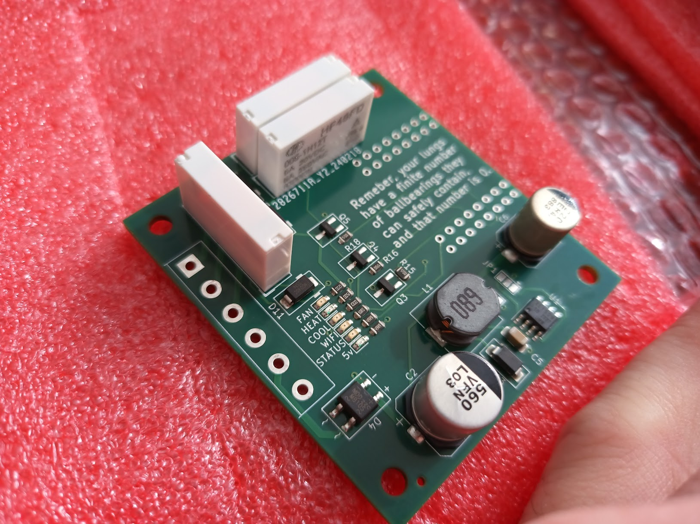

# furnace-controller
Simple 5 wire furnace controller using the Lotlin S2 Mini. Intended for ESPHome and Home Assistant or other automation uses.

# Why this exists
It's difficult to find a power supply to run an esp32 or esp8266 (or any 5vdc device for that matter) off of the 24vac transformer typically used in a furnace. This is intended to provide power and 3 relays connected to an esp8266 so that it can run anywhere that the thermostat wires are run in your house (or, as in my case, mounted directly to the furnace cabinet).

# Deets
- Accepts AC or DC input power, up to about 30V maximum. It's possible that it will accept up to 42v, but I have not tested it at that level, and you very likely will let the smoke out. Check the specs on the DC-DC IC for more info.
- 5A Relays, up to 30VDC or 250VAC contacts. 
- Avoids most of the multipurpose pins on the lotlin S2 mini, so you can use them for something else.
- Provides das blinken lighten for telling you if the furnace should be on

# Pinout

| Function | Esp32-S2 Pin |
|----------|--------------|
| Heat     |      IO35    |
| Cool     |      IO18    |
| Fan      |      IO33    |
| WIFI Led |      IO09    |
| Status LED |    IO05    |

# I WANT ONE!

You have a few options:
- whack together one using whatever you have on hand using the schematic (see the kicad project, Kicad 8.0 btw.)
- Shoot me an email at chris@voiditswarranty.com, or see VoidItsWarranty.com, and ask me to make one for you
- Have a board house like jlcpcb make you one. The kicad folder contains the production files used for my first few.

# Example ESPHome config

See furnace-controller.yaml in the root of this project for an example ESPHome config. Once it's up and running in ESPHome, you can use it as a normal set of switches for your thermostat, or any other automation that the relays can support.

# FAQ
- Q: The LEDs are too bright! A: yup, sorry about that
- Q: Will it work on my furnace? A: no idea. Probably, if it's a standard 3-5 wire thermostat and the control circuitry is 24VAC.
- Q: I don't like it. A: Neither does my carpal tunnel.